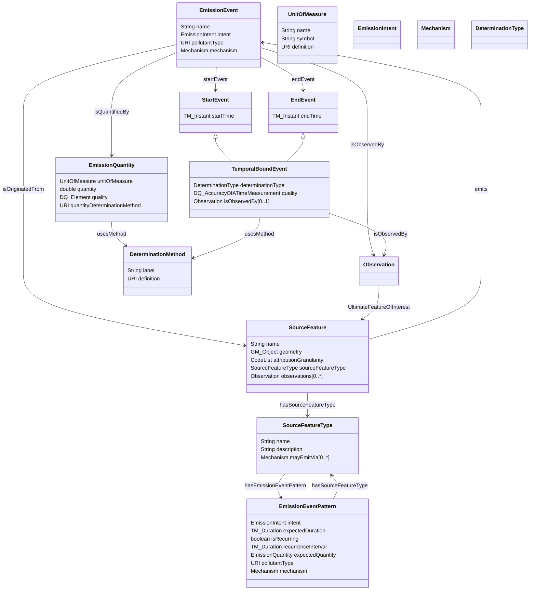
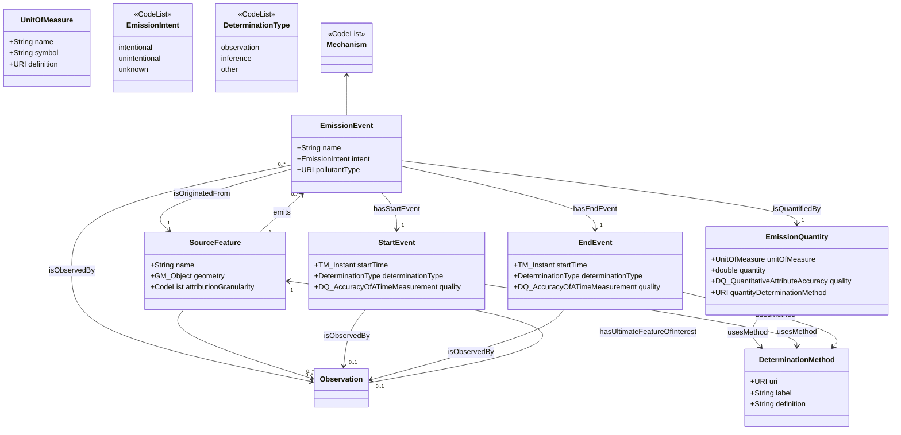

Store UML content in this directory. Feel free to use any organizational scheme that you like.

Note: Mermaid doesn't fully support UML syntax. This is for visualization and discussion only.

## EmissionML UML 2025-07-16

## EmissionML UML 2025-07-04

Figures derived from UML diagrams should be placed in the "figures" folder.
