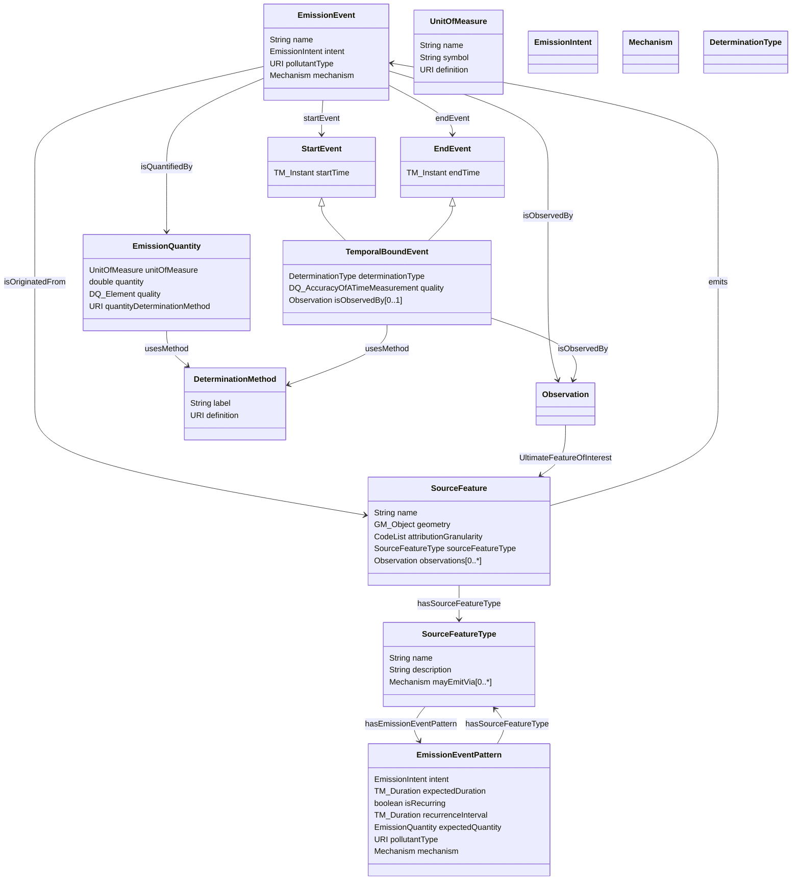

## 2025-07-16

```mermaid
classDiagram
    class EmissionEvent {
        String name
        EmissionIntent intent
        URI pollutantType
        Mechanism mechanism
    }

    class EmissionQuantity {
        UnitOfMeasure unitOfMeasure
        double quantity
        DQ_Element quality
        URI quantityDeterminationMethod
    }

    class SourceFeature {
        String name
        GM_Object geometry
        CodeList attributionGranularity
        SourceFeatureType sourceFeatureType
        Observation observations[0..*]
    }

    class StartEvent {
        TM_Instant startTime
    }

    class EndEvent {
        TM_Instant endTime
    }

    class Observation

    class DeterminationMethod {
        String label
        URI definition
    }

    class SourceFeatureType {
        String name
        String description
        Mechanism mayEmitVia[0..*]
    }

    class EmissionEventPattern {
        EmissionIntent intent
        TM_Duration expectedDuration
        boolean isRecurring
        TM_Duration recurrenceInterval
        EmissionQuantity expectedQuantity
        URI pollutantType
        Mechanism mechanism
    }

    class UnitOfMeasure {
        String name
        String symbol
        URI definition
    }

    class TemporalBoundEvent {
        DeterminationType determinationType
        DQ_AccuracyOfATimeMeasurement quality
        Observation isObservedBy[0..1]
    }

    class EmissionIntent {
    }

    class Mechanism {
    }

    class DeterminationType {
    }

    %% Inheritance
    StartEvent <|-- TemporalBoundEvent
    EndEvent <|-- TemporalBoundEvent

    %% Associations
    SourceFeature --> SourceFeatureType : hasSourceFeatureType
    SourceFeature --> EmissionEvent : emits
    EmissionEvent --> SourceFeature : isOriginatedFrom
    EmissionEvent --> StartEvent : startEvent
    EmissionEvent --> EndEvent : endEvent
    EmissionEvent --> EmissionQuantity : isQuantifiedBy
    EmissionEvent --> Observation : isObservedBy
    Observation --> SourceFeature : UltimateFeatureOfInterest
    TemporalBoundEvent --> Observation : isObservedBy
    EmissionQuantity --> DeterminationMethod : usesMethod
    TemporalBoundEvent --> DeterminationMethod : usesMethod
    SourceFeatureType --> EmissionEventPattern : hasEmissionEventPattern
    EmissionEventPattern --> SourceFeatureType : hasSourceFeatureType

    %% Annotations (non-renderable)
    %% <<CodeList>> stereotypes not directly supported in Mermaid
    %% <<ISO 19156:2023>> and <<ISO 19157>> noted but not displayed
```
