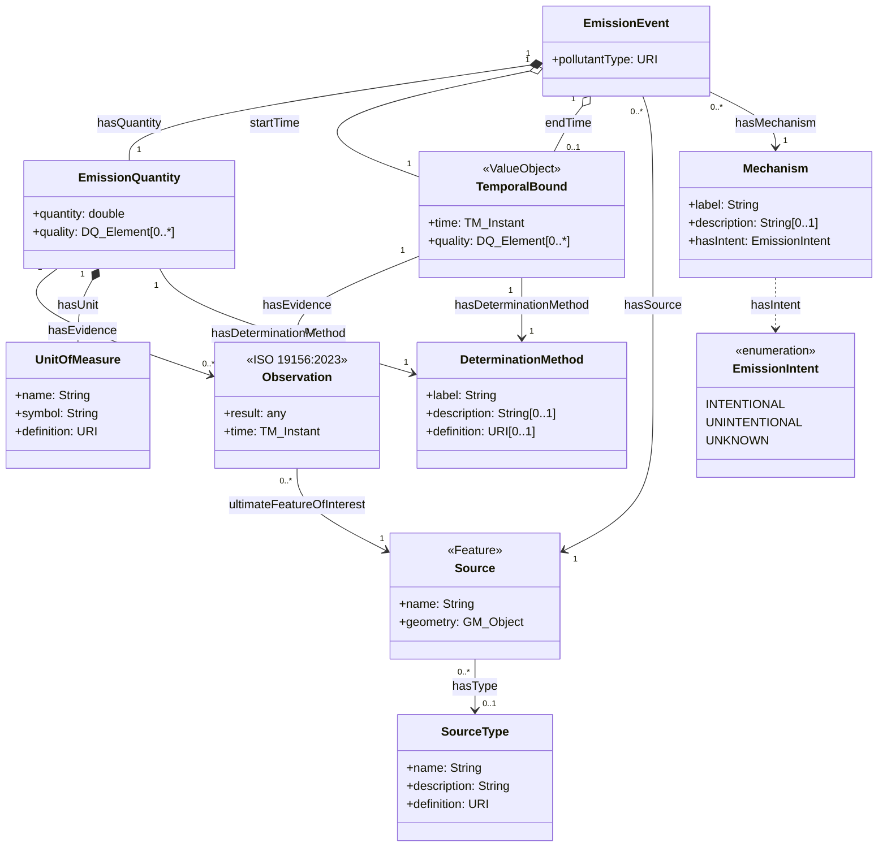

```mermaid

classDiagram
 %% title "EmissionML Refined Model (Updated)"

  class EmissionEvent {
    +pollutantType: URI
  }
  class EmissionQuantity {
    +quantity: double
    +quality: DQ_Element[0..*]
  }
  class UnitOfMeasure {
    +name: String
    +symbol: String
    +definition: URI
  }
  class TemporalBound {
    <<ValueObject>>
    +time: TM_Instant
    +quality: DQ_Element[0..*]
  }

  class Observation {
    <<ISO 19156:2023>>
    +result: any
    +time: TM_Instant
  }

  class Source {
    <<Feature>>
    +name: String
    +geometry: GM_Object
  }
  class SourceType {
    +name: String
    +description: String
    +definition: URI
  }

  class Mechanism {
    +label: String
    +description: String[0..1]
    +hasIntent: EmissionIntent
  }
  class EmissionIntent {
    <<enumeration>>
    INTENTIONAL
    UNINTENTIONAL
    UNKNOWN
  }
  class DeterminationMethod {
    +label: String
    +description: String[0..1]
    +definition: URI[0..1]
  }
  
  %% --- Relationships (Updated) ---

  %% --- EmissionEvent is the central assertion ---
  EmissionEvent "1" *-- "1" EmissionQuantity : hasQuantity
  EmissionEvent "1" o-- "1" TemporalBound : startTime
  EmissionEvent "1" o-- "0..1" TemporalBound : endTime
  EmissionEvent "0..*" --> "1" Source : hasSource
  EmissionEvent "0..*" --> "1" Mechanism : hasMechanism

  %% --- Provenance: Assertions are based on Evidence (Observations) ---
  EmissionQuantity "1" --> "0..*" Observation : hasEvidence
  TemporalBound "1" --> "0..*" Observation : hasEvidence

  %% --- Observation is of a SourceFeature ---
  Observation "0..*" --> "1" Source : ultimateFeatureOfInterest

  %% --- Quantities and Times have their own methods ---
  EmissionQuantity "1" *-- "1" UnitOfMeasure : hasUnit
  EmissionQuantity "1" --> "1" DeterminationMethod : hasDeterminationMethod
  TemporalBound "1" --> "1" DeterminationMethod : hasDeterminationMethod

  %% --- SourceFeatures and their Types ---
  Source "0..*" --> "0..1" SourceType : hasType

  %% --- Mechanism defines Intent ---
  Mechanism ..> EmissionIntent : hasIntent
```
