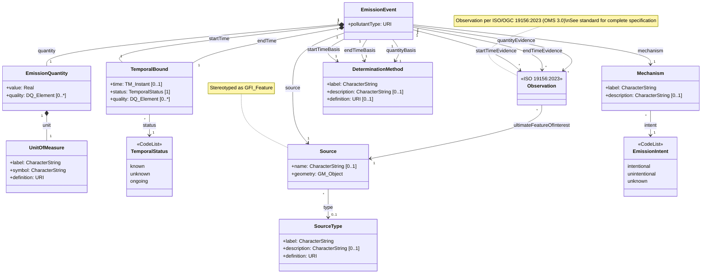

## ISO Alignment Notes

### Referenced Standards

| Standard | Types Used |
|----------|-----------|
| ISO 19103 | `CharacterString`, `Real`, `URI`, `Any` |
| ISO 19107 | `GM_Object` |
| ISO 19108 | `TM_Instant`, `TM_Object` |
| ISO/OGC 19156:2023 (OMS 3.0) | `Observation` (by reference) |
| ISO 19157 | `DQ_Element` |

### Design Decisions

1. **`label` + `definition` pattern**: Classes use `label` for human-readable display and `definition` (URI) as the universal identifier. No `name` property needed — URI provides vocabulary control without requiring local namespace management.

### Changes from Previous Version

1. **Evidence and basis lifted to EmissionEvent**: In the previous model, `EmissionQuantity` and `TemporalBound` each owned their own `hasEvidence → Observation` and `hasDeterminationMethod → DeterminationMethod` relationships. These are now role-specific associations on `EmissionEvent` (`startTimeEvidence`, `endTimeEvidence`, `quantityEvidence`, `startTimeBasis`, `endTimeBasis`, `quantityBasis`). This makes EmissionEvent the single point of access for all provenance, eliminates the need for surrogate keys on value objects, and aligns the model with the most common query pattern.

2. **TemporalBound becomes a true value object**: `TemporalBound` no longer has outgoing associations. It retains only its attributes (`time`, `quality`), making it embeddable. The `<<ValueObject>>` stereotype is removed since the semantics are now implicit.

3. **TemporalBound aggregation → composition**: `EmissionEvent o-- TemporalBound` (aggregation) changed to `EmissionEvent *-- TemporalBound` (composition). A TemporalBound cannot exist independently of its owning EmissionEvent.

4. **EmissionIntent moved from attribute to relationship**: `Mechanism.hasIntent: EmissionIntent` (inline attribute) changed to `Mechanism --> EmissionIntent : intent` (association). This treats the CodeList as a first-class referenced entity rather than an embedded value.

5. **TemporalStatus added to TemporalBound**: A new `status: TemporalStatus` mandatory attribute replaces the implicit "absent means unknown or ongoing" convention. `time` becomes conditional (`0..1`), present only when `status = known`. The `TemporalStatus` CodeList defines three values: `known`, `unknown`, `ongoing`. `endTime` multiplicity changed from `0..1` to `1` (mandatory) — temporal semantics are now explicit via `status` rather than inferred from absence. `endTimeBasis` multiplicity changed from `0..1` to `1` (conditional per Constraint C4).

### ISO Alignment

5. **Primitive types** aligned to ISO 19103:
   - `String` → `CharacterString`
   - `double` → `Real`
   - `any` → `Any`

6. **CodeList convention**: `EmissionIntent` uses lowercase values per ISO codelist style

7. **Attribute naming**: `quantity` → `value` in EmissionQuantity (more generic)

8. **Observation by reference**: Class shown without attributes; full specification per ISO/OGC 19156:2023 (OMS 3.0)
