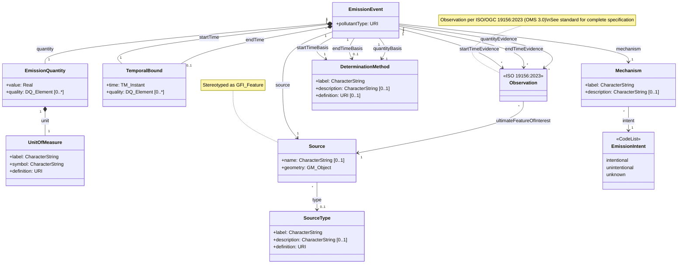

## ISO Alignment Notes

### Referenced Standards

| Standard | Types Used |
|----------|-----------|
| ISO 19103 | `CharacterString`, `Real`, `URI`, `Any` |
| ISO 19107 | `GM_Object` |
| ISO 19108 | `TM_Instant`, `TM_Object` |
| ISO/OGC 19156:2023 (OMS 3.0) | `Observation` (by reference) |
| ISO 19157 | `DQ_Element` |

### Design Decisions

1. **`label` + `definition` pattern**: Classes use `label` for human-readable display and `definition` (URI) as the universal identifier. No `name` property needed — URI provides vocabulary control without requiring local namespace management.

### Changes from Previous Version

1. **Primitive types** aligned to ISO 19103:
   - `String` → `CharacterString`
   - `double` → `Real`
   - `any` → `Any`

2. **CodeList convention**: `EmissionIntent` uses lowercase values per ISO codelist style

3. **Attribute naming**: `quantity` → `value` in EmissionQuantity (more generic)

4. **Observation by reference**: Class shown without attributes; full specification per ISO/OGC 19156:2023 (OMS 3.0)

### Encoding Profiles (to be developed)

| Encoding | Maps ISO types to |
|----------|-------------------|
| JSON | `string`, `number`, GeoJSON geometry, ISO 8601 datetime |
| CSV | String columns, WKT for geometry |
| RDF/TTL | `xsd:string`, `xsd:double`, GeoSPARQL geometry |
| GML | Native ISO/GML types |
