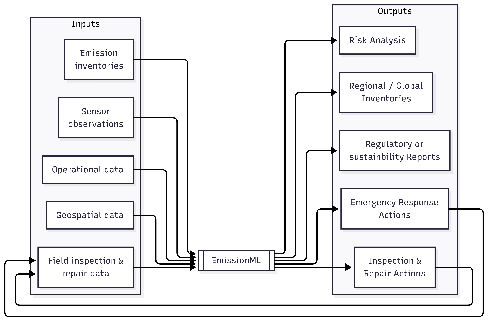

== The Problem: Lacking Consistent Ontology and Fragmentation in Emissions Data
The advancement of sensing technologies, digital communications, cloud computing, and artificial intelligence now enables the measurement, monitoring, reporting, and verification (MMRV) of emissions at unprecedented scale and resolution. Satellites can quantify atmospheric pollutants from orbit, aircraft and drones provide high-resolution overflights, continuous monitoring systems deliver real-time data streams, and handheld instruments remain essential for targeted inspections. These innovations have raised expectations for transparency and rigor in emissions reporting across regulatory and voluntary programs. Yet the data ecosystem has not kept pace: without common models and standards, the value of these new technologies is often constrained by fragmentation, duplication, and costly integrations.

This fragmentation is evident across the entire emissions data lifecycle. Each technology vendor, operator, and reporting program tends to define its own vocabulary, formats, and assumptions. Data that should be straightforward to collect becomes difficult to integrate, trace, and compare. A remote sensing detection may not align with ground-level observations — for example, bottom-up inventories — when source features are described inconsistently. Regulators often require the same data to be restated in multiple incompatible templates. Operators face the added challenge of reconciling proprietary vendor outputs with internal enterprise systems, which further drives up cost and complexity. The consequence is predictable: high costs, duplicated effort, and delays in turning detection into actionable emissions reductions.

Emissions data now stands at a similar crossroads to the early days of digital mapping. Then, geospatial information was locked in proprietary systems, requiring costly, one-off conversions with little assurance of interoperability. The introduction of open OGC standards for features and web services changed everything: today billions of people use online maps on their phones, in vehicles, and across countless applications without ever thinking about the standards that make them work. The standards became invisible, yet indispensable. Emissions data needs the same foundation. Without a shared ontology and data model, stakeholders will continue to face high costs, fragmented workflows, and limited transparency. EmissionML provides that missing layer — a future-proof, standards-aligned ontology that addresses the root causes of fragmentation, ensures consistency and traceability, and unlocks a true “Web of Emissions Information” to support faster response, credible reporting, and more effective emissions reduction.

Summary — key challenges at a glance:

* High costs and duplicated effort from bespoke integrations across vendors and systems.
* Difficulties linking diverse measurements, such as remote sensing, ground in-situ observations, and inventories, due to inconsistent definitions.
* Incompatible reporting requirements across regulatory and voluntary programs, creating administrative burden and undermining comparability.

== What EmissionML Is — and What It’s Not

=== What EmissionML Is

If new sensing technologies are expanding what is technically measurable, EmissionML is about ensuring those sensor observations can be understood, trusted, and exchanged without friction and information loss. At its core, EmissionML is a shared ontology and data model for emission events and necessary relevant metadata in order to make the emission data useful. It provides a common language to describe sources, events, and observations, so that data collected by satellites, drones, continuous monitors, or facility reporting systems can be consistently interpreted and combined to estimate the duration, location, and magnitude of an emission event. In this way, EmissionML does not replace existing tools or dictate methods; instead, it enables them to work together, much as open geospatial standards allowed different mapping systems to interoperate seamlessly.

Specifically, EmissionML provides:

	* A semantic foundation for interoperable reporting across multiple frameworks.
	* A bridge between observations (sensor or estimate), source features (the equipment or site where emissions occur), and emission events (the occurrences themselves).
	* A flexible modeling language that can serve as an intermediary data model, enabling a “write once, use many times” approach for outputs across multiple reporting frameworks.
	* Data structures that are AI-ready, ensuring that automated reasoning and validation can be applied.
	* Alignment with OGC, ISO, and W3C standards, including Observations and Measurements (ISO 19156:2023) and the SOSA/SSN ontology.

=== What EmissionML Is Not

Equally important is clarifying what EmissionML does not attempt to be:

	* It is not a methane MMRV protocol such as OGMP 2.0, Veritas, or MiQ. Instead, it can represent the data that those frameworks require.
	* It is not a fixed reporting format like a CSV schema or PDF template. EmissionML underlies such formats but does not replace them.
	* It is not an AI or ML model. While designed to be AI-ready, EmissionML itself is a data standard, not an algorithm.
	* It is not a raw sensor data format. Vendors can continue to use proprietary payloads, but EmissionML provides the normalization layer.
	* It is not a standalone software package. Instead, it is an ontology that can be implemented in software.
	* It is not the only modeling language. EmissionML complements and builds upon SOSA, O&M, and related standards.

In short: EmissionML’s strength lies in being a neutral, extensible foundation that enables diverse protocols, frameworks, and tools to interoperate seamlessly—today and as new innovations emerge.

== Use Cases: Real-world EmissionML Applications

=== EmissionML Use Cases
To illustrate EmissionML’s potential, we present real-world applications where the lack of a common ontology creates friction today — and where a shared data model can deliver clear benefits for stakeholders, such as regulators, operators, vendors, researchers and investors.

[options="header",cols="1,1,2,2,2"]
|===
| Title | Stakeholders | Problem | EmissionML Solution | Benefits

| Cross-Vendor Sensor Integration
| Sensor Vendors, Operators
| Proprietary payloads and inconsistent data models make it expensive and time-consuming to integrate multiple sensor systems.
| EmissionML normalizes observation payloads and maps them to a consistent ontology.
| Enables plug-and-play analytics, reduces integration costs, and avoids vendor lock-in.

| Super-Emitter Event Validation
| Remote Sensing Data Providers, Regulators
| It is difficult to link a detected plume with a specific facility or activity due to inconsistent source feature definitions.
| EmissionML links Observations to Source Features and Emission Events, creating an explainable and auditable validation chain.
| Reduce response time and resulting emissions, increases confidence in attribution, and builds public trust.

| Streamlined Regulatory and Voluntary Reporting
| Operators, Regulators
| Operators must reformat the same emissions data multiple times for different reporting frameworks (e.g., EPA, EU Methane Regulation, OGMP 2.0, MiQ, and others). Proprietary templates and vendor lock-in increase costs and errors.
| EmissionML enables “emit once” data publication, which can then be automatically transformed into multiple reporting formats.
| Reduces compliance cost and effort, ensures consistency across frameworks, and improves auditability.

| Real-Time Operational Response
| Operators, Control Rooms, Emergency Response Centres
| Control rooms and emergency response centres often receive fragmented event feeds from multiple systems, delaying diagnosis and coordinated action.
| EmissionML provides a normalized event stream that can be shared and brokered across platforms.
| Accelerates root-cause analysis, reduces downtime, and shortens detection-to-response cycles.

| Carbon-Market Quantification and Verification
| Offset Project Developers, Auditors
| Carbon credits depend on accurate quantification of avoided or reduced emissions, but calculations are often opaque.
| EmissionML encodes emission quantities together with essential metadata, uncertainties and provenance.
| Increases integrity of carbon credits, reduces verification cost, and improves market confidence.

| Interoperable Emissions Simulation
| Engineering Firms, Researchers
| Simulation tools use incompatible models, limiting comparability and reuse.
| EmissionML represents simulation inputs and outputs as standardized Emission Events.
| Makes simulation results comparable and repeatable, enabling cross-study benchmarking.

| Financial Risk and ESG Analysis
| Banks, Investors, Insurers
| ESG risk assessments are based on inconsistent, non-comparable emissions disclosures.
| EmissionML structures emissions data for ingestion into financial risk models.
| Improves risk-based lending and investment decisions, supports credible ESG scoring.
|===

=== What the world looks like with EmissionML
Imagine a world where emissions data flows as seamlessly as financial information or digital maps. A plume detected by satellite is automatically linked to a site, verified against ground-based monitors, and cross-checked with operational data — all within minutes. Regulators receive reports in a consistent, auditable format without manual re-entry. Operators diagnose and repair leaks in hours instead of weeks. Investors and insurers compare emissions performance across companies with the same confidence they place in audited financial statements. Researchers build upon shared datasets instead of recreating them. In such a future, EmissionML is invisible but indispensable: the common foundation that makes emissions information trustworthy, interoperable, and actionable at global scale.

== Adoption Pathways & Call to Action

Turning this vision into reality requires broad adoption. Just as OGC’s open standards unlocked the geospatial web, EmissionML will only deliver its full value through collective action. No single actor can overcome emissions data fragmentation alone. Regulators, operators, technology vendors, researchers, and investors all have a vital role to play in building a shared, standards-based foundation. The pathways below outline concrete steps that each community can take to accelerate adoption and unlock the benefits of a seamless “Web of Emissions Information.”

* Regulators: reference EmissionML when designing reporting templates to ensure interoperability from the start.
* Operators: adopt EmissionML internally to manage emissions data consistently; require providers and consultants to deliver EmissionML-compliant data.
* Software Vendors: implement EmissionML compatibility in data management platforms to ensure regulatory and ESG readiness.
* Sensor Providers: map observation payloads and uncertainties to EmissionML to simplify integration and expand market reach.
* Investors and ESG Analysts: request EmissionML-tagged datasets in due diligence processes; use EmissionML-compliant tools for analysis.
* Researchers and Academia: use EmissionML in models and publications; release datasets in EmissionML to maximize impact and reuse.

[options="header",cols="2,2,2"]
|===
| Action | Stakeholders | Value

| **Reference EmissionML** when designing regulatory or voluntary reporting templates to ensure interoperability from the start.
| Regulators, reporting framework developers
| Reduces template fragmentation, improves comparability, and simplifies compliance checks.

| **Adopt EmissionML** internally to manage emissions data consistently, and require consultants and data providers to deliver EmissionML-compliant outputs.
| Organizations that use emissions data for reporting, compliance, or analysis
| Ensures consistent internal workflows, lowers integration costs, and increases confidence in reported data.

| **Implement EmissionML** compatibility in software platforms to ensure ESG readiness and future-proof integration.
| Software vendors and solution providers building data management, processing, sharing, publishing, or visualization tools
| Future-proofs products, accelerates customer onboarding, and increases platform interoperability.

| **Map sensor payloads** and associated uncertainties to EmissionML to simplify integration and expand market reach.
| Sensor manufacturers and technology developers producing emissions measurement systems
| Makes devices plug-and-play across ecosystems, reduces custom integration burden, and broadens adoption.

| **Request EmissionML-tagged data** in due diligence processes, and use EmissionML-compliant tools for ESG and financial analysis.
| Investors, financial institutions, and ESG analysts using emissions data in performance and risk assessments
| Improves transparency, strengthens ESG credibility, and supports better risk-based investment decisions.

| **Apply EmissionML** in research workflows and simulation models, and release datasets in EmissionML to maximize reusability and impact.
| Researchers and academics collecting, processing, or publishing emissions data and derived results
| Increases reproducibility, enables cross-study comparability, and maximizes scientific and policy impact.
|===

Many OGC standards, from web mapping to the Sensor Web and the Internet of Things, have become foundational to our digital world. By building EmissionML on this proven technical and reputational foundation, we're creating a standard that is not only robust and extensible but also poised for similar global adoption. To further this goal and provide the highest level of assurance, we plan to follow the path of many successful OGC standards by pursuing joint standardization with the International Organization for Standardization (ISO). This strategic step will ensure EmissionML meets the rigorous requirements for international endorsement, making it a credible and indispensable tool for regulatory, academic, and commercial applications worldwide.

How to Get Involved:

* Explore the https://github.com/opengeospatial/EmissionML[OGC EmissionML GitHub].
* Contribute use cases, implementations, or vocabulary feedback.
* Join the https://www.ogc.org/membership/[OGC EmissionML Standards Working Group] and shape the future of emissions interoperability.
