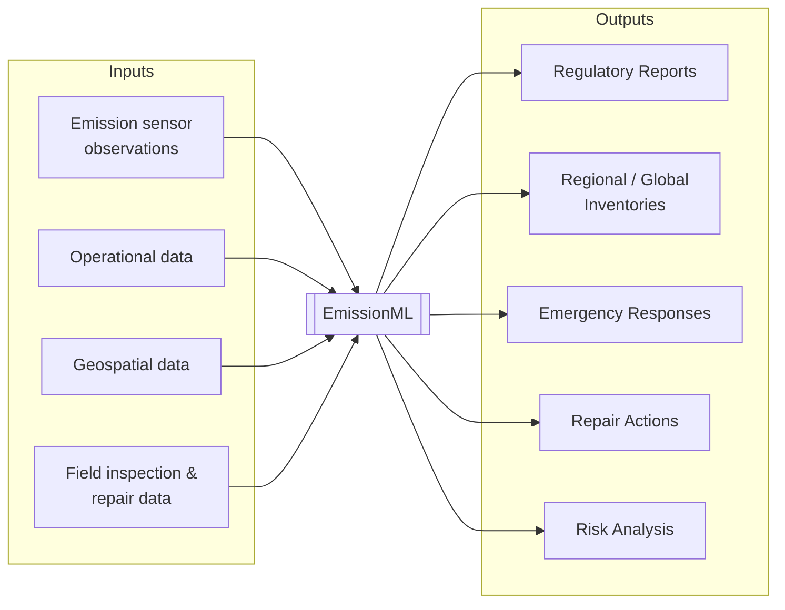

```mermaid
flowchart LR
  %% Inputs
  subgraph Inputs
    A[Emission sensor<br/>observations]
    B[Operational data]
    C[Geospatial data]
    D[Field inspection &amp;<br/>repair data]
  end

  %% Core
  E[[EmissionML]]

  %% Outputs
  subgraph Outputs
    F[Regulatory Reports]
    G[Regional / Global<br/>Inventories]
    H[Emergency Responses]
    I[Repair Actions]
    J[Risk Analysis]
  end

  %% Flows
  A --> E
  B --> E
  C --> E
  D --> E

  E --> F
  E --> G
  E --> H
  E --> I
  E --> J
```
